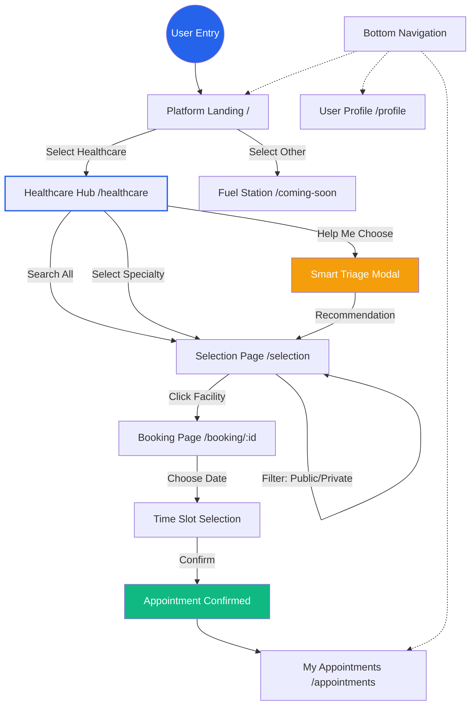

# Astawash Platform Flow Map

This diagram illustrates the user journey through the Astawash platform, highlighting how the different pages connect to create a seamless booking experience.

### Key Stages in the Flow:

1.  **Platform Landing**: The high-level entry where users choose between Healthcare, Government, or Finance sectors.
2.  **Healthcare Hub**: A dedicated space to identify the *type* of care needed (General, Dental, etc.).
3.  **Selection Page**: A filtered list of specific hospitals or clinics. This is the "bridge" between discovery and action.
4.  **Booking Page**: The final step where users interact with the schedule and secure their spot.
5.  **Global Navigation**: The Bottom Nav allows users to jump between their active appointments, their profile, and the home screen at any time.
